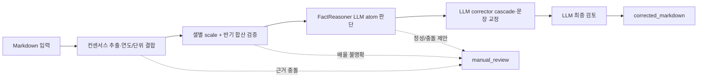

# RippleRepair API — 영업이익 전망 교정

## 한 줄 설명

재무 리서치 Markdown 파일을 Web UI에서 선택하거나 API로 본문을 보내면 최신 컨센서스를 결정론적으로
추출·계산하고, FactReasoner LLM이 사실 판단·문장 교정·최종 검토를 수행한 Markdown을 반환합니다.



## 무엇이 달라지나

예를 들어 최신 2026년 영업이익 컨센서스가 `35조원`인데 중간 전망이 `3,500조원`으로
기재됐다면, `0.01`배 교정이 컨센서스와 정합하는지 검증합니다. 조건을 통과하면 시나리오의
숫자 토큰을 고치고, 결론의 “중간 영업이익 전망은 3,500조원”도 `35조원`으로 함께 고칩니다.

| 단계 | 확인하는 것 | 자동 적용 조건 | 결과 |
|---|---|---|---|
| 컨센서스 추출 | 최신 날짜, 영업이익 열, 원/억원/조원, 대상 연도 | 열·단위·연도가 모순되지 않음 | 선택 근거와 추출 trace |
| 숫자 교정 | 각 상·중·하 셀 및 단일 연간 값 | 지원 배율(최근접), 부호 일치, 순서 유지 | 셀별 전후 값과 배율 |
| 반기 합산 | 상반기 + 하반기 = 연간 | 연간이 컨센서스로 고정되고 유일한 ≤2% 해 | 잘못된 블록 또는 단일 셀만 변경 |
| FactReasoner corrector | 동일 금액 재인용과 연결 문장 | LLM 판단·교정·최종 검토 승인 | 교정 Markdown 또는 수동 검토 |

## API 사용

비개발자는 `http://localhost:8200/forecast-correction`에서 Markdown 파일을 선택하고
교정본을 다운로드할 수 있습니다. 개발자 연동의 권장 호출은 하나입니다.

```http
POST /api/forecasts/operating-profit/correct
Content-Type: application/json

{"markdown_text": "<컨센서스와 전망이 포함된 Markdown>"}
```

응답의 `corrected_markdown`이 최종 반환물입니다. 변경 근거는 `scale_correction.corrections`,
`factreasoner.scale_interventions`, `factreasoner.cascades`,
`factreasoner.applied_corrections`에서 확인합니다. `stats.manual_review_required`가 참이면
`scale_correction.review_items`, `factreasoner.manual_review`, `factreasoner.error`를 함께 봅니다.

## 지원 범위

- 섹션 번호와 무관한 `최근 컨센서스 전망치 분석` 블록
- Markdown 표, dataframe/plain text, 쉼표·소수·과학적 표기
- 원·억원·조원 열 단위와 원/억원 이중 열 교차검증
- 여러 전망연도의 컨센서스를 잘못 재사용하지 않는 연도 결합
- 셀마다 다른 배율 오류와 정상 셀 혼재
- 음수 영업손실
- 상반기/하반기/연간 블록 및 단일 셀 합산 오류
- CRLF, 목록, 굵게, 표 등 Markdown 형식 보존

## 안전 경계

- 서버의 원본 파일은 쓰지 않습니다. `corrected_markdown` 저장 여부는 호출자가 결정합니다.
- 개발자 API의 `graph_mode` 기본값은 `llm`입니다. `fast`도 FactReasoner LLM cascade/atom 판정을 생략하지 않습니다.
- 외부 Quick Tunnel Web UI도 기본 `LLM 정밀`을 사용하며, `Fast`를 선택해도 FactReasoner 판단·교정·검토는 LLM으로 실행됩니다.
- Web UI의 `LLM 정밀`은 비동기 job 제출·polling을 사용하므로 긴 reasoning 처리 중에도 브라우저 요청이 유지됩니다.
- 개별 LLM 교정 응답은 4096 token 출력 예산을 사용해 reasoning 뒤 JSON 종료 토큰이 잘리지 않도록 합니다.
- FactReasoner graph/judge/cascade/review 호출에는 역할별 JSON schema를 함께 전달합니다. schema
  모드를 지원하지 않는 OpenAI-compatible 서버는 `json_object`로 재시도하며, 코드펜스·부가 문장·
  잘못된 escape를 견디는 balanced-object parser와 필수 필드 검증을 거칩니다. 두 번 모두 실패하거나
  응답이 잘리면 Markdown에 반영하지 않고 수동 검토로 보냅니다.
- 최종 rereview payload는 전체 원문과 교정본을 중복 전송하지 않고 실제 변경 span 쌍과 제한된 주변
  문맥만 포함합니다. 적용 변경이 0건이면 rereview LLM 호출을 건너뜁니다.
- `/correct`는 scale → 재인용 ripple → FactReasoner cascade/atom → 산술 가드 → 재검토 순입니다.
  H1+H2=연간이 맞으면 재검토가 그 이유로 교정본을 되돌리지 않습니다. `/scale-correction`은
  결정론 제안을 항상 반환하고 재검토는 advisory입니다.
- 자동 교정의 사실 판단·교정은 Fact Atom Graph partition당 최대 128개 정도의 bounded batch turn으로
  실행됩니다. 판단 turn에서 `correct`로 분류된 atom만 교정 turn으로 넘어가며, batch 누락은
  fail-closed 수동 검토로 처리합니다. partition은 연결 tree/component와 source chunk를 기준으로
  구성하고, 직렬화 payload가 길면 같은 tree 안에서만 BFS 순서로 추가 분할합니다. 각 partition은
  첫 atom의 부모 1개와 마지막 atom의 자식 1개를 있으면 reference-only 경계 문맥으로 덧붙입니다.
  경계 노드는 `is_boundary_context=true`, `correction_allowed=false`로 표시되어 자동 교정에서
  제외되고, 부모·자식 충돌은 하위 노드 우선 규칙으로 LLM에 전달됩니다.
- Muse Glimmer는 `n_gpu_layers=all`로 이미 GPU 오프로딩되어 있습니다. scale-pin cascade와 후보 atom 판정은 4개 inference slot에 맞춰 최대 4개씩 병렬 실행하며, Markdown 적용 후 최종 검토도 LLM으로 수행합니다.
- `97조1467억원`·`49조2063억원` 같은 혼합 금액은 단일 atom으로 파싱하고, `숫자%숫자` 형태의 손상 금액은 자동 교정하지 않고 수동 검토로 보냅니다.
- 긴 문서는 20분 이상 걸릴 수 있어 Web UI가 최대 60분 동안 비동기 job을 polling합니다.
- 중복 문구, 연도·단위 충돌, 부호 불일치, 불명확한 배율은 결정론적 scale 단계에서 보류하고, 구조 변경·근거 부족 제안은 LLM 검토에서 보류합니다.
- `/correct`는 확정 pin과 동일한 제한적 ripple만 자동 병합합니다. 새 계산값·정성적 재작성과
  독립 `/propagate-correction` 결과는 제안으로 보존합니다.
- LLM 연결 오류가 HTTP 200 응답 안에 기록될 수 있으므로 `online`, `error`, 수동 검토 플래그를 확인합니다.
- 외부 배포에는 API gateway 인증, TLS, 본문 로그 마스킹, 승인 저장 절차가 필요합니다.

## 전달 파일

- [개발자용 API 계약](README.md)
- [실행 가능한 Markdown 요청](examples/correct-markdown-request.json)
- [고급 FactReasoner 호출 흐름](examples/factreasoner-workflow.md)
- [Postman 컬렉션](ripple-repair-api.postman_collection.json)
- [5장 발표자료 초안](presentation/outline.md)
